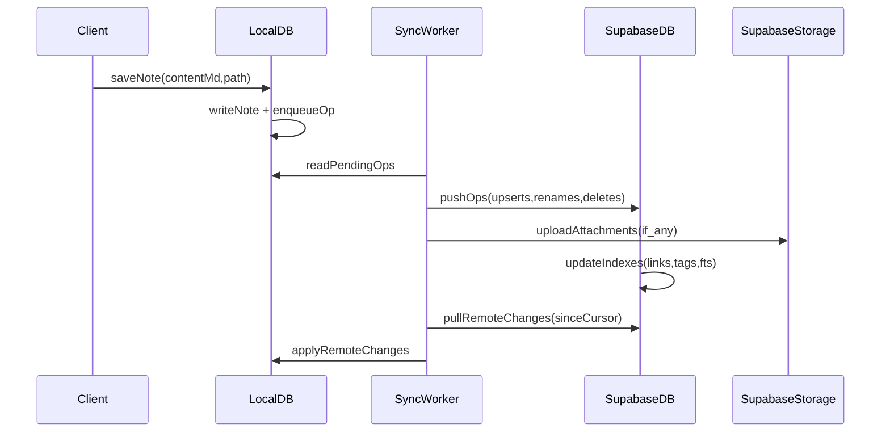

# Obsidian-like Notes: Full Implementation Plan (Supabase + Tauri + React Native)

## Goal

Build a detailed note-taking system (Obsidian-like) inside your Planner/Calendar app that:

- Stores notes as Markdown strings
- Supports folders, tags, wiki-links (`[[Note]]`), backlinks, graph, and search
- Works offline on desktop + mobile (primary) and web (secondary)
- Syncs via Supabase over HTTPS + auth (server-readable)

This plan is **project-outline only** (no code), focused on architecture, milestones, and what to build in what order.

---

## Recommended Technology Stack

### Frontend / Clients

- **Web**: keep current **React + Vite + TypeScript**
- **Desktop**: **Tauri** (Rust shell) + React UI
- **Mobile**: **React Native with Expo**

### Local persistence (offline-first)

- **Local DB**: SQLite per device
  - Desktop: SQLite file stored locally
  - Mobile: Expo SQLite
  - Web: IndexedDB (or SQLite WASM later); start with IndexedDB for simplicity

### Backend

- **Supabase**
  - **Auth**: email/password or magic link (single user now, but do it cleanly)
  - **Database**: Postgres
  - **Storage**: attachments (images, PDFs)
  - Optional: Edge functions for server-side indexing workflows

### Search

- **Phase 1**: Postgres full text search (FTS) for server search
- **Phase 2**: local search via SQLite FTS5 on desktop/mobile (fast offline)

### Markdown rendering / parsing

- Rendering: your current `react-markdown` + `remark-gfm`
- Parsing for features: a small shared TS parser for:
  - wiki links `[[...]]`
  - tags `#tag/subtag`
  - headings for outline
  - optional YAML frontmatter

---

## Product Scope: Features (by priority)

### Core MVP (must-have)

- Notes vault navigation: folders + note list
- Create/rename/move/delete notes
- Markdown editor + preview
- Wiki links `[[Note]]` with autocomplete
- Backlinks panel
- Search (title + body)
- Offline-first + background sync

### V1 (Obsidian-feel)

- Tags panel and tag search
- Graph view (basic)
- Outline panel (headings)
- Attachments and embeds
- Daily notes + templates
- Quick switcher (Cmd+P style) on desktop

### V2 (power features)

- Conflict UI + version history
- Block references / heading references
- Transclusion (embed note/section)
- Better editor (MDX-ish experience, markdown shortcuts)

---

## System Architecture

### High-level data flow

- Client stores notes locally (SQLite) and works offline.
- Client queues changes as “operations” (create/update/rename/delete).
- Sync worker pushes ops to Supabase and pulls remote changes.
- Server stores canonical data and generates derived indexes:
  - backlinks graph
  - tags index
  - search index

### Mermaid: offline-first sync concept



---

## Data Model

### Canonical objects

- **Note**
  - `id` (uuid)
  - `path` (e.g. `notes/projects/project_alpha.md`)
  - `title` (derived, but stored)
  - `content_md` (Markdown source of truth)
  - `revision` (integer increment) or `updated_at`
  - `deleted_at` (soft delete)
- **Attachment**
  - `id`
  - `note_id` (optional)
  - `storage_path`
  - `mime_type`, `size`

### Derived indexes

- **note_links** (outbound edges)
- **note_tags**
- **search document** (tsvector)

### Markdown conventions

- Canonical: Markdown in `content_md`
- Wiki links: `[[Note Title]]` and optionally `[[path/to/note]]`
- Tags: `#tag` and `#tag/subtag`
- Optional frontmatter (later):

```md
---
tags: [project, work]
aliases: ["Alpha"]
created: 2026-01-14
---

# Project Alpha

...
```

---

## Supabase Backend Plan

### Phase 0: Project setup

- Create a Supabase project
- Enable Auth provider(s)
- Create Storage bucket for attachments
- Decide environment separation:
  - `dev` and `prod` Supabase projects (recommended)

### Database schema (recommended)

Tables (in `public` schema):

- `notes`
- `note_links`
- `note_tags`
- `note_changes` (optional; for operation log)
- `attachments`

Key columns

- `notes.user_id` (uuid) references `auth.users.id`
- `notes.path` unique per `user_id`
- `notes.content_md` text
- `notes.revision` integer (optimistic concurrency)

### RLS policies

Because you are single-user, you can still use real RLS so you are future-proof.

- `notes`: user can only access rows where `user_id = auth.uid()`
- Same for links/tags/attachments

### Server-side indexing

On every note upsert, update derived indexes.

Recommended approaches:

- **Option A (simple first):** do indexing in the client and send derived rows (links/tags) with the note update.

  - Pro: no server code
  - Con: trust client; still fine for single-user

- **Option B (recommended V1):** do indexing server-side
  - Use Postgres trigger + function OR Supabase Edge Function
  - Parse markdown server-side to extract links/tags/title

Given “HTTPS + auth” and your desire for Obsidian-like behavior, I recommend:

- Start with Option A for speed
- Move to Option B once stable (better consistency)

### Search

- Server search: Postgres `tsvector` updated on note write
- Local search (desktop/mobile): SQLite FTS5 built from local notes

### Attachments

- Store binary in Supabase Storage
- Store metadata in `attachments` table
- Reference in Markdown via normal markdown links:
  - ``

---

## Sync Strategy (Offline-first)

### Why not just “store everything only in Supabase”

Desktop/mobile-first note apps feel best when:

- you can open notes instantly
- you can edit offline
- search is instant

So each client keeps a local DB and syncs.

### Sync algorithm (practical)

Start with an easy, reliable approach:

- Each note has `revision` integer.
- Client updates note by sending `expectedRevision`.
- Server accepts if matches, increments revision.
- If mismatch, server rejects with conflict info.

Conflict handling (MVP)

- If conflict, client shows:
  - local version
  - remote version
  - allow “keep mine” / “take remote”

Change tracking

- Keep a `sync_cursor` (timestamp or incrementing id) in a per-device table.
- Pull remote changes since cursor.

Operations that must be supported

- Create note
- Update content
- Rename/move (path change)
- Delete (soft delete)

---

## Repo / Project Structure (recommended)

You currently have a single web app repo. To add desktop + mobile cleanly, plan to evolve into a small monorepo.

Suggested structure:

- `apps/web/` (your current React/Vite app moved here)
- `apps/desktop/` (Tauri wrapper + shares UI package)
- `apps/mobile/` (Expo app)
- `packages/shared/` (types, markdown parsing, link/tag extraction)
- `packages/notes-engine/` (sync logic, conflict rules, indexing helpers)

If you want minimal disruption early, you can postpone the monorepo move until after the web Notes MVP is working.

---

## Implementation Phases and Milestones

### Milestone 1: Notes MVP on web (no desktop/mobile yet)

Goal: prove data model, UI patterns, and Supabase integration.

Deliverables

- Notes tab in UI
- Note list + note editor
- Create/rename/delete
- Markdown preview
- Save/load from Supabase

Notes

- You can keep weekly planning state local for now; notes are the first persistent system.

### Milestone 2: Linking, backlinks, tags, search (web)

Deliverables

- `[[link]]` autocomplete
- Backlinks panel
- Tag extraction + tag panel
- Search endpoint + UI

### Milestone 3: Offline-first local DB + sync worker (web)

Deliverables

- Local persistence (IndexedDB)
- Background sync
- Conflict handling UI

### Milestone 4: Desktop app (Tauri)

Deliverables

- Desktop wrapper using the same UI
- Local SQLite persistence
- File system integrations (optional): export vault folder
- Keyboard shortcuts + quick switcher

### Milestone 5: Mobile app (Expo)

Deliverables

- Mobile navigation for notes
- Mobile editor experience
- Local SQLite persistence
- Background sync
- Attachment picking and upload

### Milestone 6: Obsidian-like “nice to have”

Deliverables

- Graph view
- Outline panel
- Daily notes + templates
- Version history

---

## Detailed Feature Checklist (build order)

### Notes CRUD

- Create note with default template
- Edit title (derived from first H1 or filename)
- Rename/move by changing `path`
- Soft delete + restore

### Editor

- Split view (edit/preview)
- Auto-save with debounce
- Wiki link autocomplete
- Basic markdown shortcuts (later)

### Backlinks

- Show list of notes that reference current note
- Show snippets around the link (later)

### Search

- Search title + content
- Filter by tag, folder

### Attachments

- Upload image
- Insert markdown image link at cursor
- Render image in preview

---

## Security / Auth (single user, but solid)

- Use Supabase Auth
- Store session securely
  - Web: standard Supabase client session storage
  - Mobile: secure storage (Expo SecureStore)
  - Desktop: OS keychain or equivalent
- Keep RLS enabled even as single user

---

## Testing and Quality Strategy

- Unit test markdown parsing (links/tags/title extraction)
- Integration test sync logic (revision conflicts)
- Manual test matrix:
  - offline edits then reconnect
  - rename note referenced by others
  - attachment upload and rendering

---

## Rollout / Deployment

- Web: Vercel/Netlify (or any static host) + Supabase
- Desktop: Tauri build + auto-update later
- Mobile: Expo EAS build and store distribution

---

## Risks and Mitigations

- **Conflict complexity**: start with revision-based conflicts + simple UI
- **Editor quality**: start simple (textarea + preview), upgrade later
- **Web offline parity**: keep web support but optimize primarily for mobile/desktop
- **Link resolution edge cases**: define canonical link target rules early

---

## Next Actions (what you do first)

1. Create Supabase project (dev)
2. Define schema and RLS for `notes` (plus minimal search)
3. Add Notes tab to current web app, implement CRUD using Supabase
4. Add link/tag extraction + backlinks queries
5. Introduce local DB + sync worker
6. After web MVP feels solid, begin desktop (Tauri) and mobile (Expo)
